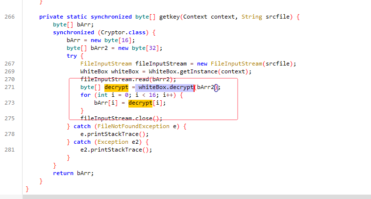
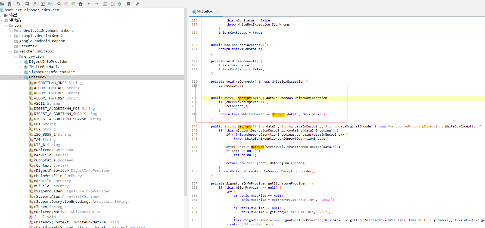
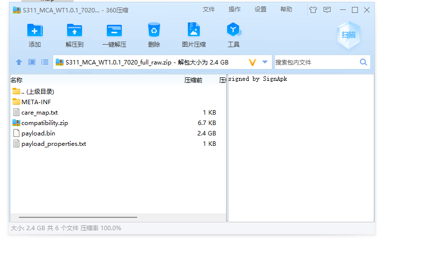
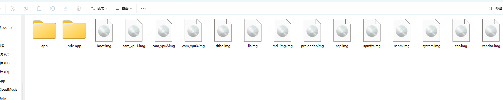

Decrypt——长安全系 系统更新包解包工具，不同车机需要不同的key

payload-dumper-go-64—— 将img提取出的工具

额额额额额额额，， 这个key就需要逆向去。

大致逻辑是，去/system/bin/sd_ivi_data/ckey 获取这个文件，
然后使用 系统 whiteBox.decrypt 方法去对这个文件进行解密，获取

import com.weichen.whitebox.encrytion.WhiteBox;
这个文件的逻辑则在 boot-framework.vdex
可以找到解密方法

最终获取key，进行解密

解密出来的包：

payload.bin  则需要使用工具吗，进行提取img

提取的img 

